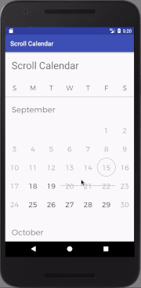

# Scroll Calendar

[ ](https://bintray.com/rafalmanka/maven/scroll-calendar/_latestVersion)
[](https://android-arsenal.com/details/1/6228)

Android widget to present calendar in a recycler view. The idea was to
replicate calendar the way calendar is presented in the amazing
Airbnb app.



## Installing

Import the library into gradle

```
implementation ('pl.rafman.widgets:scroll-calendar:3.1.0')
```

### Getting Started

Define layout in your xml file.

**your_layout.xml**
```xml
<pl.rafman.scrollcalendar.ScrollCalendar
        android:layout_width="match_parent"
        android:layout_height="match_parent" />
```

**styles.xml**
```xml
<style name="MyAppTheme" parent="Theme.AppCompat.Light.DarkActionBar">
    <item name="scrollCalendarStyleAttr">@style/MyScrollCalendarStyle</item>
</style>

<style name="MyScrollCalendarStyle">
    <item name="legendSeparatorStyle">@style/MyLegendSeparatorStyle</item>
    <item name="currentDayStyle">@style/MyCurrentDayStyle</item>
    <item name="disabledItemStyle">@style/MyDisabledItemStyle</item>
    <item name="unavailableItemStyle">@style/MyUnavailableItemStyle</item>
    <item name="selectedItemStyle">@style/MySelectedItemStyle</item>
     <item name="selectedBeginningItemStyle">@style/MySelectedItemBeginningStyle</item>
    <item name="selectedMiddleItemStyle">@style/MySelectedItemMiddleStyle</item>
    <item name="selectedEndItemStyle">@style/MySelectedItemEndStyle</item>
    <item name="legendItemStyle">@style/MyLegendItemStyle</item>
    <item name="monthTitleStyle">@style/MyMyMonthTitleStyle</item>
    <item name="dayStyle">@style/MyDayStyle</item>
</style>

<style name="MyDayStyle">
    <item name="android:textColor">@android:color/black</item>
    <item name="android:background">@android:color/transparent</item>
</style>

<style name="MyDisabledItemStyle">
    <item name="android:textColor">@android:color/darker_gray</item>
    <item name="android:background">@android:color/transparent</item>
</style>

<style name="MyUnavailableItemStyle">
    <item name="android:textColor">@android:color/darker_gray</item>
    <item name="android:background">@drawable/scrollcalendar_strikethrough</item>
</style>

<style name="MyLegendSeparatorStyle">
    <item name="android:background">@android:color/darker_gray</item>
    <item name="android:height">1dp</item>
</style>

<style name="MyMonthTitleStyle">
    <item name="android:textAllCaps">false</item>
    <item name="android:gravity">left</item>
    <item name="android:textSize">16sp</item>
    <item name="android:textColor">@android:color/black</item>
</style>

<style name="MyCurrentDayStyle">
    <item name="android:background">@drawable/scrollcalendar_circle_outline</item>
    <item name="android:textColor">@android:color/black</item>
</style>

<style name="MySelectedItemStyle">
    <item name="android:background">@drawable/scrollcalendar_circle_full</item>
    <item name="android:textColor">@android:color/white</item>
</style>

<style name="MySelectedItemMiddleStyle">
    <item name="android:background">@drawable/scrollcalendar_range_middle</item>
    <item name="android:textColor">@android:color/white</item>
</style>

<style name="MyLegendItemStyle">
    <item name="android:gravity">center</item>
    <item name="android:textSize">14sp</item>
    <item name="android:padding">10dp</item>
    <item name="android:textColor">@android:color/black</item>
</style>

<style name="MySelectedItemEndStyle">
    <item name="android:background">@drawable/scrollcalendar_range_end</item>
    <item name="android:textColor">@android:color/white</item>
</style>

<style name="MySelectedItemBeginningStyle">
    <item name="android:background">@drawable/scrollcalendar_range_start</item>
    <item name="android:textColor">@android:color/white</item>
</style>

```

#### Styling in layout.xml
If for some reason you prefer to style directly in your layout file, you
are free to do so. set the styles for given element inside of the xml layout directly.

```xml
<pl.rafman.scrollcalendar.ScrollCalendar
        android:layout_width="match_parent"
        android:layout_height="match_parent" />
```

### Default adapters

If you only want some basic functionality out of the widget, you can
use one of our two built in adapters. First one is for selecting a date,
second one is for selecting a range of dates. Just declare which one
you want to use in layout.xml or styles.xml. If you don't declare this value,
no behavior will be applied and you should use callbacks to control the
calendar as described further on in this readme.

You have following types of adapters to choose from: "date", "range" or "none".
Default value is "none" so you don't have to declare anything.

**your_layout.xml**
```xml
<pl.rafman.scrollcalendar.ScrollCalendar
    ...
    scrollcalendar:adapter="date"
    ...
    />
```
or **styles.xml**
```xml
<style name="MyScrollCalendarStyle" parent="@style/ScrollCalendarStyle">
    ...
    <item name="adapter">range</item>
    ...
</style>
```

If you want the value of the selected date or range, call:
*scrollCallendar.getAdapter()*. This method will return the
adapter and you can use specific methods to retrieve dates.
Take a look at the examples to learn how to do it.

### More control

If you have more advanced needs, you can control the behavior of the
calendar by using callbacks.
Reference the widget in your Activity/Fragment and set callback

```java
ScrollCalendar scrollCalendar = (ScrollCalendar) findViewById(R.id.scrollCalendar);
scrollCalendar.setOnDateClickListener(new OnDateClickListener() {
    @Override
    public void onCalendarDayClicked(int year, int month, int day) {
        // user clicked on a specific date on the calendar
    }
});
scrollCalendar.setDateWatcher(new DateWatcher() {
    @Override
    public int getStateForDate(int year, int month, int day) {
        //    CalendarDay.DEFAULT,
        //    CalendarDay.DISABLED,
        //    CalendarDay.TODAY,
        //    CalendarDay.UNAVAILABLE,
        //    CalendarDay.SELECTED,
        return CalendarDay.DEFAULT;
    }
});
scrollCalendar.setMonthScrollListener(new MonthScrollListener() {
    @Override
    public boolean shouldAddNextMonth(int lastDisplayedYear, int lastDisplayedMonth) {
        // return false if you don't want to show later months
        return true;
    }
    @Override
    public boolean shouldAddPreviousMonth(int firstDisplayedYear, int firstDisplayedMonth) {
        // return false if you don't want to show previous months
        return true;
    }
});
```

#### States
Calendar supports Different states that a day can have in a month.
Each state can be expressed by applying specific drawable background and
a text color.
* CalendarDay.DEFAULT - Regular day with no background
```
scrollcalendar:dayStyle="@style/DayStyle"
```
* CalendarDay.DISABLED - When you want to indicate that the date
is not available.
```
scrollcalendar:disabledItemStyle="@style/DisabledItemStyle"
```
* CalendarDay.TODAY - for expressing current date
```
scrollcalendar:currentDayStyle="@style/CurrentDayStyle"
```
* CalendarDay.UNAVAILABLE - when day is not available take, or invalid.
```
scrollcalendar:unavailableItemStyle="@style/UnavailableItemStyle"
```
* CalendarDay.SELECTED - When a day is selected. In order to display ranges properly you need
to set Beginning, middle and end drawables according to your style.
Proper drawables will be used automatically when two or more selected
dates are placed next to each other.
```
scrollcalendar:selectedItemStyle="@style/SelectedItemStyle"
scrollcalendar:selectedBeginningItemStyle="@style/OrangeSelectedItemBeginningStyle"
scrollcalendar:selectedEndItemStyle="@style/OrangeSelectedItemEndStyle"
scrollcalendar:selectedMiddleItemStyle="@style/OrangeSelectedItemMiddleStyle"
```

## Contributing

* File [bug report](https://github.com/RafalManka/ScrollCalendar/issues/new)
* Request [feature](https://github.com/RafalManka/ScrollCalendar/issues/new)
* Create [Pull request](https://github.com/RafalManka/ScrollCalendar/pulls)

## Authors

* **Rafal Manka** - [Linkedin](https://www.linkedin.com/in/rafał-mańka-40ba2b5b)


## License

This project is licensed under the Apache 2.0 License.

## Acknowledgments

* Inspiration - Airbnb

