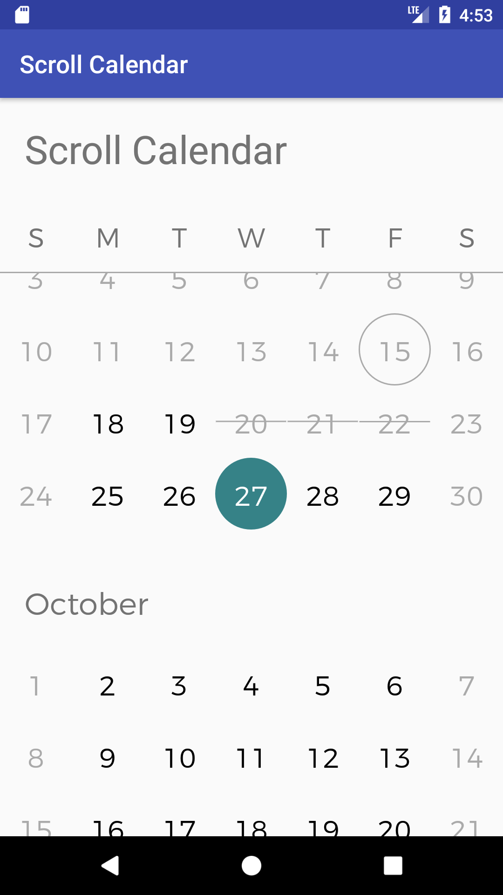

# Scroll Calendar

Android widget to present calendar in a recycler view. The idea was to
replicate calendar the way calendar is presented in the amazing
Airbnb app.



## Installing

Improt the library into gradle

```
compile 'pl.rafalmanka:scroll-calendar:1.3.0'
```

### Getting Started

Define layout in your xml file

```
<com.rafalmanka.scrollcalendar.ScrollCalendar
        android:id="@+id/scrollCalendar"
        android:layout_width="match_parent"
        android:layout_height="0dp"
        android:layout_weight="1"
        scrollcalendar:backgroundColor="@android:color/transparent"
        scrollcalendar:currentDayBackground="@drawable/circle_outline"
        scrollcalendar:currentDayTextColor="@android:color/darker_gray"
        scrollcalendar:customFont="fonts/montserrat-light.otf"
        scrollcalendar:disabledBackgroundColor="@android:color/transparent"
        scrollcalendar:disabledTextColor="@android:color/darker_gray"
        scrollcalendar:fontColor="@android:color/black"
        scrollcalendar:selectedBackground="@drawable/circle_full"
        scrollcalendar:selectedTextColor="@android:color/white"
        scrollcalendar:unavailableBackground="@drawable/dash"
        scrollcalendar:unavailableTextColor="@android:color/darker_gray" />
```

Reference the widget in your Activity/Fragment

```
ScrollCalendar scrollCalendar = (ScrollCalendar) findViewById(R.id.scrollCalendar);

```

Setup callback
```
scrollCalendar.setCallback(new ScrollCalendarCallback() {

            @Override
            public int getStateForDate(int year, int month, int day) {
                return doGetStateForDate(year, month, day);
            }

            @Override
            public void onCalendarDayClicked(int year, int month, int day) {
                doOnCalendarDayClicked(year, month, day);
            }

            @Override
            public boolean shouldAddNextMonth(int lastDisplayedYear, int lastDisplayedMonth) {
                return doShouldAddNextMonth(lastDisplayedYear, lastDisplayedMonth);
            }

});
```

End with an example of getting some data out of the system or using it for a little demo

## Contributing

* Request feature
* Create Pull request

## Authors

* **Rafal Manka** - [Linkedin](https://www.linkedin.com/in/rafał-mańka-40ba2b5b)


## License

This project is licensed under the Apache 2.0 License.

## Acknowledgments

* Inspiration - Airbnb

